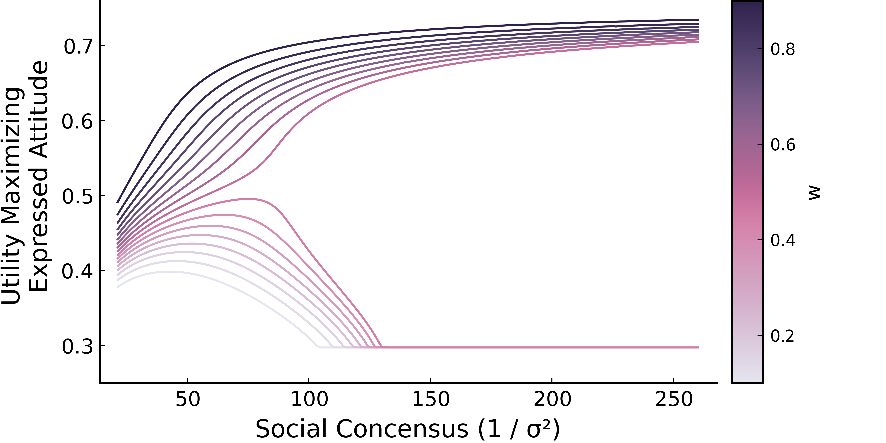

# SocialSamplingTheory.jl

This repository is a Julia package for Social Sampling Theory (SST). SST describes how expressed 
attitudes emerge from a social comparison process that maximizes the utility two competing goals: authenticity preference and social extremeness aversion. Authenticity preference refers to the desire to behave and express attitudes consistent with one's private attitudes. Social extremeness aversion refers to the desire to behave and express attitudes consistent with one's social network. In SST, private attitudes and social norms are represented as distributions. Several effects, such as homophily, polarization, and the backfire effect, emerge from the interplay of utility maximization and one's the attitude distribution of one's local social context. 

# API

The API for SocialSamplingTheory.jl provides a small set of essential functions and types 
for developing models for SST. 

## Functions

SocialSamplingTheory.jl provides the following functions:

- `get_utility`
- `maximize_utility!`
- `maximize_utility`
- `distance`
- `update_attitudes!`
- `judge_neighborhood!`

## Types 

SocialSamplingTheory.jl provides the following types for [Agents.jl](https://github.com/JuliaDynamics/Agents.jl):

- `SocialAgent`

Documentation for the API can be access in the REPL e.g.,

```julia 
] SocialAgent
```

# Backfire Effect 

In this section, we will demonstrate how to use SocialSamplingTheory.jl with an example based on the backfire effect. The backfire effect occurs when a person becomes more confident in a belief after encountering disconfirming evidence. In SST, the backfire effect occurs under two conditions: (1) w < .5, meaning authenticity preference is weighted more than social extremeness aversion, and (2) the social concensus is high and shifted away from a person's attitude distribution. At some point, this tension becomes so great that more utility is gained from "being true to oneself". 

The following simulation shows that the backfire effect depends on parameter w and social consensus, defined as the inverse of the variance of the social attitude distribution. 

## Load Dependencies

We will begin by loading the required dependencies. 

```julia 
using SocialSamplingTheory, Distributions, Plots
```

## Simulation Parameters 

In the simulation, we will assume the person is moderately liberal, but the person's social network is moderately conservative. The last line shows that we will vary parameter w from .1 to .9.

```julia 
# parameter of beta distribution coded as conservative
α = 4
# parameter of beta distribution coded as liberal 
β = 9
# parameter of beta distribution coded as conservative for social network
αn = 6.0
# parameter of beta distribution coded as liberal for social network 
βn = 2.2
# utility sensitivity parameter 
γ = 20.0
#  weights for social extremeness aversion
ws = .1:.05:.9
```
## Simulation Function 

The simulation function below varies social consensus and computes the publicly expressed attitude. Social consensus is varied by increasing the $\beta$ and $\alpha$ parameters of the Beta distribution such that the
median of the distribution is fixed at the value implied by parameters αn and βn. 

```julia 
function sim_backfire(α, β, αn, βn, w, γ)
    K = .40:.025:6
    n = length(K)
    attitudes = fill(0.0, n)
    precisions = fill(0.0, n)
    target_median = median(Beta(αn, βn))
    for (i,k) in enumerate(K)
        α′ = k * αn
        β′ = (α′ - 1 / 3) / target_median + 2/3 - α′
        attitude = maximize_utility(α, β, α′, β′ , w, γ)
        σ² = var(Beta(α′, β′))
        precisions[i] = 1 / σ²
        attitudes[i] = attitude
    end
    return precisions, attitudes
end
```

## Run Simulation 

Next, we will will run the simulation and extract the precision (i.e. social consensus measure) and the publically displayed attitudes. 

```julia 
data = sim_backfire.(α, β, αn, βn, ws, γ)
precision = data[1][1]
attitude = map(x -> x[2], data)
```

## Plot Results 

The figure below shows the public attitude as a function of social consensus and parameter w. Each color coded line corresponds to predictions at different values of w. When w < .5, there is initial increase conformity with the social network. However, once social consensus increases to a certain point, the persons expressed value diverges further and further from the group norm. When w ≥ .5, SST predicts increasing levels of conformity as social consensus increases. 

```julia 
plot(
    precision,
    attitude,
    ylims = (.25,.76),
    xtickfontsize = 10,
    ytickfontsize = 10,
    xguidefontsize = 12,
    yguidefontsize = 12,
    legendfontsize = 8,
    colorbar_title = "w",
    colors = ws,
    xlabel = "Social Concensus (1 / σ²)",
    ylabel = "Utility Maximizing 
    Expressed Attitude",
    grid = false,
    label = "",
    lc = cgrad(:acton, [ws;]'; rev=true),
    line_z = (ws)',
    size = (600,300),
    dpi = 800
)
```



# References

Brown, G. D., Lewandowsky, S., & Huang, Z. (2022). Social sampling and expressed attitudes: 
Authenticity preference and social extremeness aversion lead to social norm effects and polarization. Psychological review, 129(1), 18.